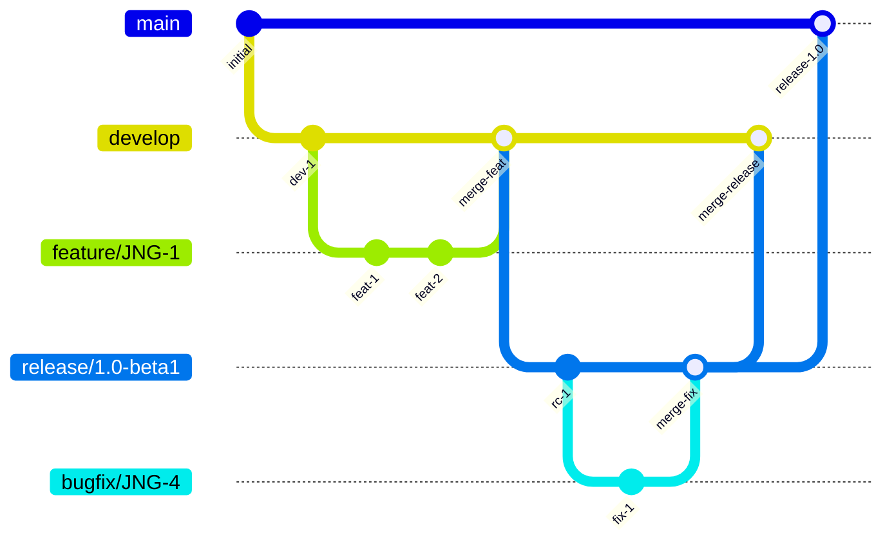
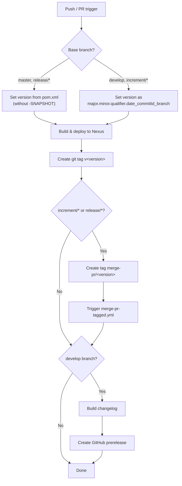
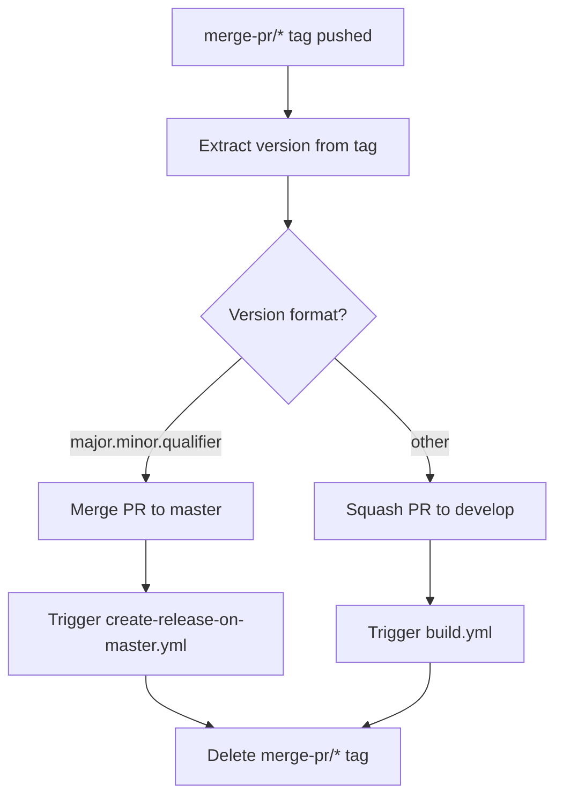
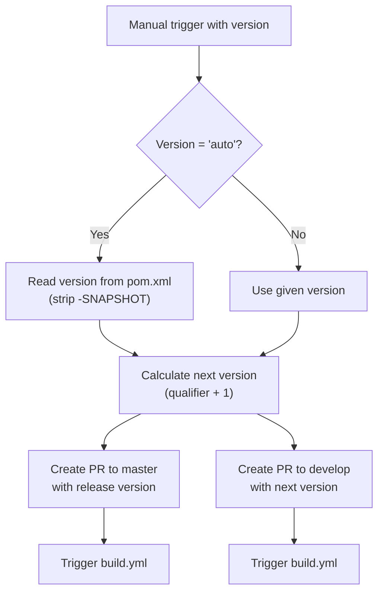

# CI/CD Flow — Development Versioning and Branch Handling

This document describes the branching strategy, version numbering, and GitHub Actions CI/CD pipelines used by this project.

## Branching Strategy

The project follows a GitFlow-based model with these branch types:

| Branch Pattern | Base | Purpose |
|----------------|------|---------|
| `develop` | — | Main development branch; contains latest sources for the active version |
| `feature/JNG-xxx_summary` | `develop` | New features for the current version |
| `release/x.y.z` or `x_y_z` | `develop` | Release stabilization branches |
| `bugfix/JNG-xxx_summary` | release branch | Bug fixes applied during release testing |
| `support/JNG-xxx_summary` | release branch | Minor post-release changes merged back to the release branch |
| `master` | — | Latest released sources |
| `hotfix/JNG-xxx_summary` | `master` | Urgent fixes applied to both release and master |

## Version Numbering

Version numbers follow semantic versioning with these rules:

| Event | Version Change |
|-------|---------------|
| Start a `feature/` branch | No change — inherits from `develop` |
| Start a `release/` branch | 2nd number on `develop` is incremented |
| Start a `bugfix/` branch | No change — applied on release branches before merging to master |
| Start a `support/` branch | 3rd number is incremented |
| Start a `hotfix/` branch | 4th number is incremented |

## GitHub Actions Pipelines

The CI/CD system is composed of four interconnected workflows that automate building, tagging, merging, and releasing.

### build.yml — Main Build Pipeline

Triggers on pushes to `develop` and pull requests to `develop`, `master`, `increment/*`, `release/*`.

### merge-pr-tagged.yml — PR Merge Automation

Triggers when a `merge-pr/*` tag is pushed.

### create-release-on-master.yml — Release Creation

Triggers on pushes to `master`.

Extracts the version from the tag, builds a changelog, and creates a GitHub release (marked as latest).

### release.yml — Manual Release Trigger

Manually triggered with a version parameter (`auto` or `major.minor.qualifier`).

## Development Rules

> **Important:** Every commit must reference a JIRA ticket number (`JNG-xxx`). There is no commit without a ticket number.

Issue tracking: [JIRA](https://blackbelt.atlassian.net/jira/dashboards)
