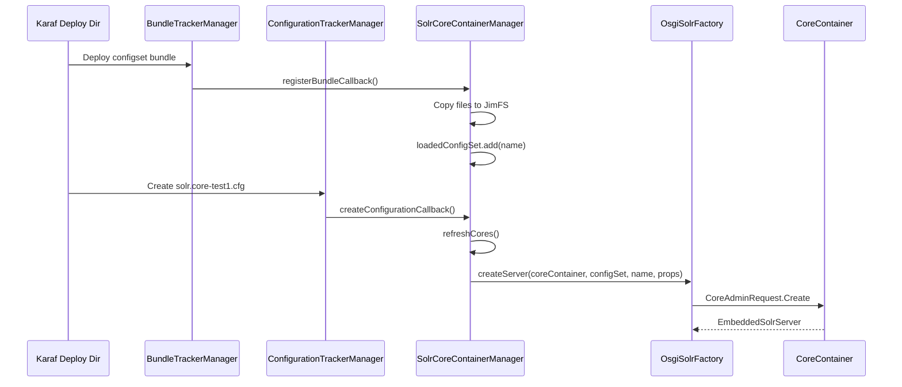
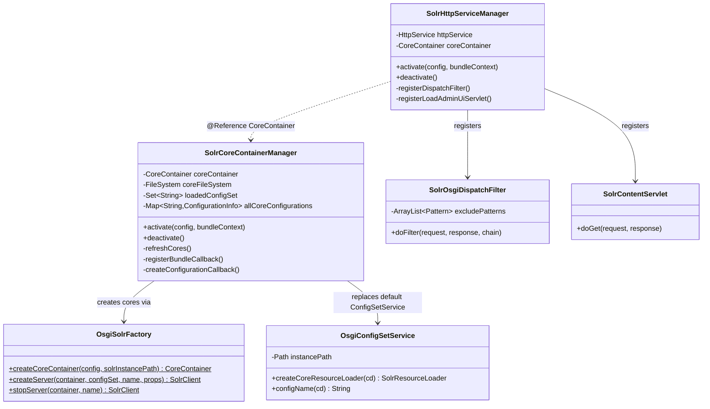
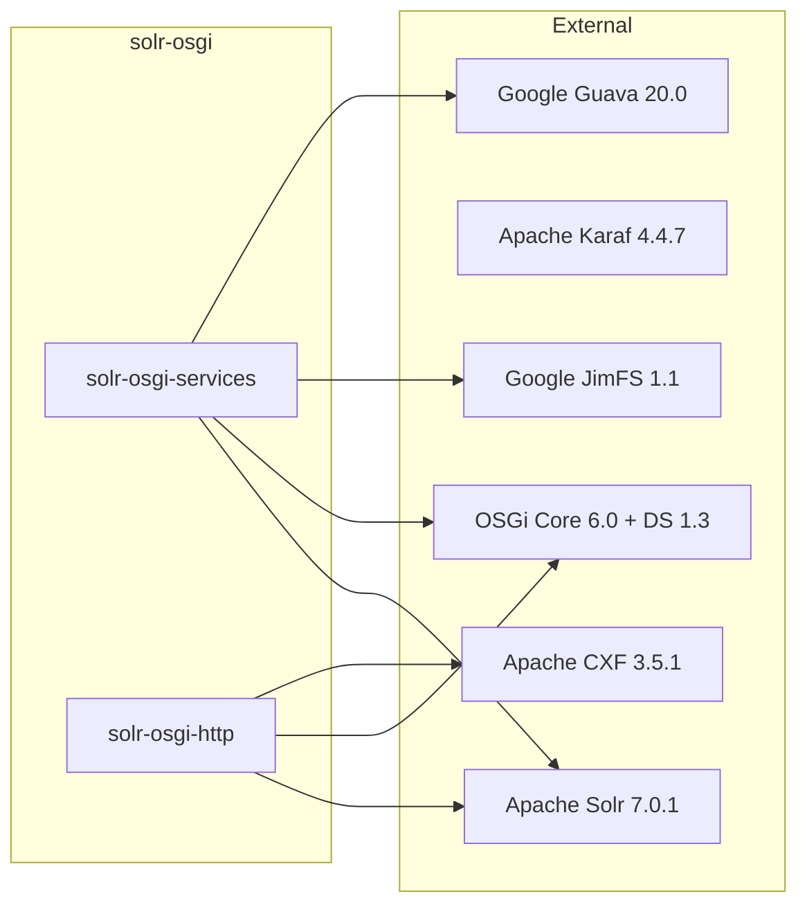

# Solr OSGi

Solr OSGi enables running Apache Solr as an embedded server inside an OSGi container (Apache Karaf). It brings OSGi's dynamic lifecycle — hot-deploy, configuration-driven activation, bundle tracking — to Solr, so that cores, configsets, and HTTP endpoints can be managed at runtime without restarts.

> **Note:** Not all Solr features are supported. Clustering and sharding have not been tested. A Cellar-based SolrCloud implementation is planned. Currently only configSet-based cores are available.

## Architecture Overview

The project is organized into six Maven modules, each serving a distinct layer of the architecture.

```mermaid
graph TD
    ExCfg["solr-osgi-example-configsets-exampleCollection<br/><i>Example ConfigSet Bundle</i>"]
    NwCfg["solr-osgi-example-configsets-dataimportNorthwind<br/><i>DataImport Example Bundle</i>"]
    Services["solr-osgi-services<br/><i>Core Container & ConfigSet Management</i>"]
    Http["solr-osgi-http<br/><i>HTTP Endpoints & Admin UI</i>"]
    Feature["solr-osgi-feature<br/><i>Karaf Feature Descriptor</i>"]
    Karaf["solr-osgi-karaf<br/><i>Offline Karaf Distribution</i>"]

    ExCfg -.->|configset bundle| Services
    NwCfg -.->|configset bundle| Services
    Http -->|@Reference CoreContainer| Services
    Feature -->|aggregates| Services
    Feature -->|aggregates| Http
    Karaf -->|includes| Feature
```

### How It Works

The central orchestrator is `SolrCoreContainerManager`, an OSGi Declarative Services component that monitors two things:

1. **ConfigSet bundles** — any OSGi bundle with a `Solr-Configset` manifest header. When such a bundle is deployed, its config files are copied into a JimFS in-memory filesystem so Solr can load them.
2. **Core configurations** — OSGi config PIDs matching `solr.core` or `solr.core-<name>`. Each one defines a Solr core (name + configSet reference + optional properties).

When both a configSet and a matching core configuration are present, the manager creates the core. When either is removed, the core is stopped (but its data directory is preserved for reuse).



### Component Diagram



### External Dependencies



## Installation and Usage

### Option A: Use the Pre-built Karaf Distribution

Build the entire project, then run the bundled Karaf:

```bash
./mvnw clean install
./run-karaf
```

Two example features are embedded. Once Karaf is running, open the Felix web console at `http://localhost:8181/system/console/features` (username/password: `karaf`/`karaf`) and install the `exampleCollection` or `exampleNorthwind` features.

> **Note:** For the Northwind example (SQL DataImport), start the MySQL container **before** installing the feature:
> ```bash
> docker run --name northwind -itd -e MYSQL_ROOT_PASSWORD=northwind -p 3306:3306 bylek/northwind-mysql
> ```

After installing a feature, the Solr Admin UI is available at `http://localhost:8181/solr`.

### Option B: Use Your Own Karaf

Any OSGi 6.0 container works. Tested with Apache Karaf 4.3.6+.

```bash
# In Karaf console
feature:repo-add cxf
feature:repo-add mvn:hu.blackbelt/solr-osgi-feature/<version>/xml/features
feature:install -v solr-http
```

### Configuration

Three OSGi configuration PIDs drive the system:

| PID | File in `karaf/deploy` | Purpose |
|-----|------------------------|---------|
| `solr.corecontainer` | `solr.corecontainer.cfg` | Container-level settings (solrHome, ZooKeeper, etc.) |
| `solr.core-<name>` | `solr.core-test1.cfg` | Per-core definition (name, configSet, custom properties) |
| `solr.http` | `solr.http.cfg` | HTTP endpoint settings (contextRoot) |

**Minimal setup — create these files in `karaf/deploy`:**

`solr.corecontainer.cfg`:
```properties
solrHome=/tmp/solr
```

`solr.core-test1.cfg`:
```properties
name=test1
configSet=exampleCollection
```

`solr.http.cfg`:
```properties
contextRoot=/solr
```

### Creating ConfigSet Bundles

A configSet bundle is a standard OSGi bundle with:
- A `Solr-Configset: <name>` header in `META-INF/MANIFEST.MF`
- Config files placed at `configsets/<name>/conf/` inside the JAR

Deploy the bundle to Karaf (e.g., copy to `karaf/deploy`). The `SolrCoreContainerManager` automatically detects it, copies files into the in-memory store, and makes the configSet available for core creation.

## Core Container Parameters

The `solr.corecontainer` PID accepts the same parameters as standard Solr configuration (solr.xml), including:
- `nodeName`, `solrHome`, `coreRootDirectory`, `configSetBaseDir`
- `coreLoadThreads`, `shareSchema`, `transientCacheSize`, `sharedLib`
- ZooKeeper settings: `zkRun`, `zkHost`, `zkClientTimeout`
- SolrCloud settings: `solrcloud_host`, `solrcloud_hostPort`, etc.
- Shard handler factory: `shardHandleFactoryName`, `shardHandleFactoryClass`, HTTP parameters
